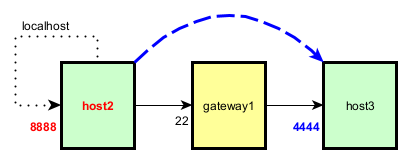
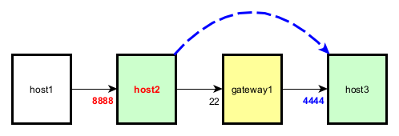
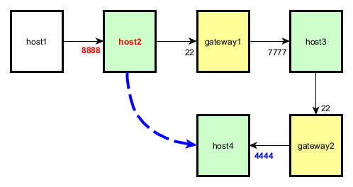

# Test SSH local port forwarding

## Preparation

In order to execute the tests successfully, it is necessary to set up the test environment beforehand. This environment is available as a collection of Docker containers. For detailed instructions on creating the test environment, please refer to [this guide](test-env/README.md).

## Test 1

On `host2`, we start a local port forwarding:

	ssh -N -L localhost:8888:host3:4444 dev@gateway1

All data sent to the TCP socket `localhost:8888` (relatively to `host2`) is forwarded to the TCP socket `host3:4444`, through `gateway1`:

* Entry: `localhost:8888` (on `host2`)
* Exit: `host3:4444`

On `host3`:

	cd /home/dev
	./pinger-service.sh 4444

On `host2`:

	nc localhost 8888
	PING

## Test 2

host2:

	ssh -N -L host2:8888:host3:4444 dev@gateway1

All data sent to the TCP socket `host2:8888` (`192.168.1.11` being the IP address of `host2`) is forwarded to the TCP socket `host3:4444`, through `gateway1`.

* Entry: `host2:8888`
* Exit: `host3:4444`

host3:

	cd /home/dev
	./pinger-service.sh 4444

host1:

	nc host2 8888
	PING

## Test 3

host2:

	ssh -N -L host2:8888:host3:7777 dev@gateway1

All data sent to the TCP socket `host2:8888` (`192.168.1.11` being the IP address of `host2`) is forwarded to the TCP socket `host3:7777`, through `gateway1`.

* Entry: `host2:8888`
* Exit: `host3:7777`

host3:

	ssh -N -L host3:7777:host4:4444 dev@gateway2

All data sent to the TCP socket `host3:7777` (`192.168.1.13` being the IP address of `host3`) is forwarded to the TCP socket `host4:4444`, through `gateway2`.

* Entry: `host3:7777`
* Exit: `host4:4444`

Therefore:

All data sent to the TCP socket `host2:8888` is forwarded to the TCP socket `host4:4444`, through `gateway2`.

* Entry: `host2:8888`
* Exit: `host4:4444`

host4:

	cd /home/dev
	./pinger-service.sh 4444

host1:

	nc host2 8888
	PING

