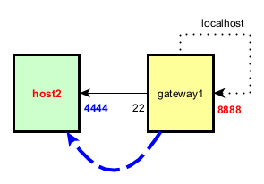
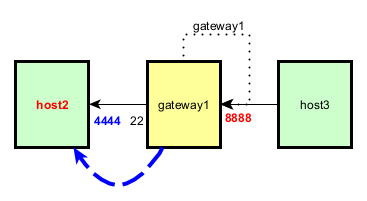

# Test SSH remote port forwarding

## Preparation

In order to execute the tests successfully, it is necessary to set up the test environment beforehand. This environment is available as a collection of Docker containers. For detailed instructions on creating the test environment, please refer to [this guide](test-env/README.md).

## Test 1

On host2:

	ssh -N -R 8888:localhost:4444 dev@gateway1

All data send to the TCP socket `localhost:8888` (relatively to `gateway1`) is forwarded to the TCP socket `localhost:4444` (relatively to `host2`).

* Entry: `localhost:8888` (on `gateway1`)
* Exit: `localhost:4444` (on `host2`)

And:

	cd /home/dev
	./pinger-service.sh 4444

On gateway1:

	nc localhost 8888
	PING

## Test 2

On host2:

	ssh -N -R gateway1:8888:localhost:4444 dev@gateway1

All data sent to the TCP socket `gateway1:8888` (`192.168.1.12` being the IP address of `gateway1`) is forwarded to the TCP socket `localhost:4444` (relatively to `host2`).

* Entry: `gateway1:8888`
* Exit: `localhost:4444` (on `host2`)

> Important note: this example works beaucoup the default SSHD configuration has been modified!
> Within the SSHD configuration file (`/etc/ssh/sshd_config`), the parameter `GatewayPorts` is set to `yes`.

And:

	cd /home/dev
	./pinger-service.sh 4444

On gateway1:

	nc gateway1 8888
	PING

On host3:

	nc gateway1 8888
	PING

## Test 3

On host2:

	ssh -N -R gateway1:8888:host2:4444 dev@gateway1

All data sent to the TCP socket `gateway1:8888` (`192.168.1.12` being the IP address of `gateway1`) is forwarded to the TCP socket `host2:4444` (`192.168.1.11` being the IP address of `host2`).

* Entry: `gateway1:8888`
* Exit: `host2:4444`

On gateway1:

	ssh -N -R gateway2:7777:gateway1:8888 dev@gateway2

All data sent to the TCP socket `gateway2:7777` (`192.168.1.12` being the IP address of `gateway1`) is forwarded to the TCP socket `gateway1:8888` (`192.168.1.14` being the IP address of `gateway1`).

* Entry: `gateway2:7777`
* Exit: `gateway1:8888`

Therefore:

All data sent to the TCP socket `gateway2:7777` is forwarded to the TCP socket `host2:4444`.

* Entry: `gateway2:7777`
* Exit: `host2:4444`

> Important note: this example works beaucoup the default SSHD configuration has been modified!
> Within the SSHD configuration file (`/etc/ssh/sshd_config`), the parameter `GatewayPorts` is set to `yes`.

On host2:

	cd /home/dev
	./pinger-service.sh 4444

On host4:

	nc gateway2 7777
	PING

